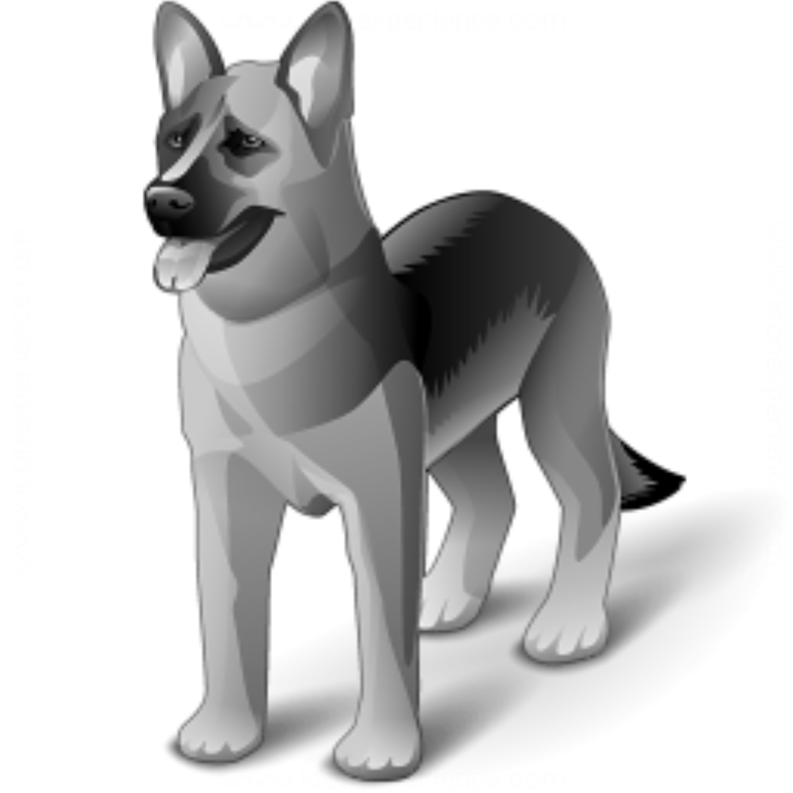
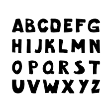
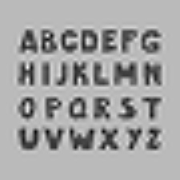
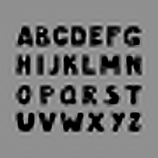

# Interpolation

## Bilinear interpolation

I implemented bilinear interpolation to resize some image of a dog

## Differentiable Interpolation

### **Math**

Given a density grid $D$ of shape $H, W$ and an image, compute the density of a pixel $(x,y)$ in the image as $\text{softplus}(\text{interp}((x,y), D))$. Interpolation is linear here, so it is differentiable.

You optimize $D$ to reduce the MSE between the reconstructed original image and the original image

### **Results**
The following is using a gride size of shape $H//5, W//5$, where $H,W$ is the size of the image

**Ground truth**: 

**Using no nonlinearity, just linear interpolation**: 

**Linear interpolation with softplus nonlinearity**: 

Notice that the edges are sharper compared to the nonlinear version. 